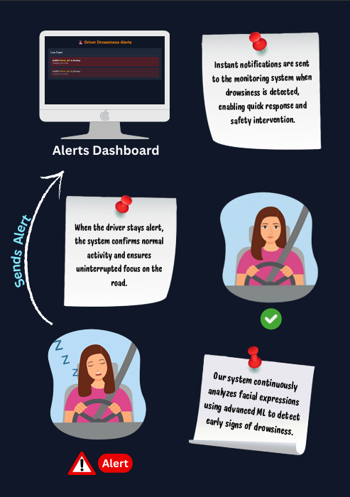

# 🚗 Driver Drowsiness Detection System

**A real-time system that detects driver fatigue using computer vision.**  
It features a **Next.js web dashboard** and an **Android mobile app** for live monitoring and alerts, ensuring safer driving experiences.

---

## 🧠 Overview

Driver drowsiness is one of the leading causes of road accidents worldwide.  
This project aims to **detect early signs of driver fatigue** through eye-blink analysis and facial recognition, then **alert the driver** and **notify connected systems** in real time.

---

## ⚙️ System Components

- 🖥️ **Web App (Next.js):** Real-time dashboard for monitoring driver status and alerts  
- 🤖 **ML Model / Backend:** Processes live video feed, performs face & eye detection, and determines drowsiness  
- 📱 **Android App:** Provides mobile alerts and notifications  
- ☁️ **API / Server:** Connects all modules for data synchronization  

---

## 🚀 Features

✅ Real-time drowsiness detection using facial landmarks and eye-blink analysis  
✅ Visual and audio alerts for driver fatigue  
✅ Web dashboard for real-time monitoring  
✅ Android app for mobile notifications  

---

## 🧩 Tech Stack

| Component | Technology |
|------------|-------------|
| **Frontend (Web)** | Next.js, React, Tailwind CSS |
| **Mobile App** | Android (Kotlin / Java) |
| **Backend** | Next.js (API Routes / Server-side Logic) |
| **Database** | Firebase |

## 🧠 How It Works

1. **Camera Feed:** Captures live video of the driver.  
2. **Face & Eye Detection:** track eye blinks and facial states.  
3. **Drowsiness Detection:** Classifies driver state (Alert / Drowsy).  
4. **Alert Mechanism:** Sends real-time audio alerts and updates dashboard and app.  

<<<<<<< HEAD

=======

>>>>>>> d2dda6ca459edccf1e973bc460719e69ccc37579

